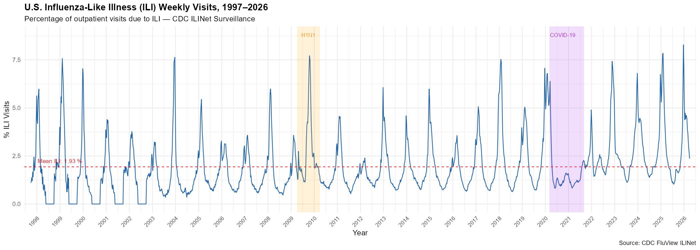
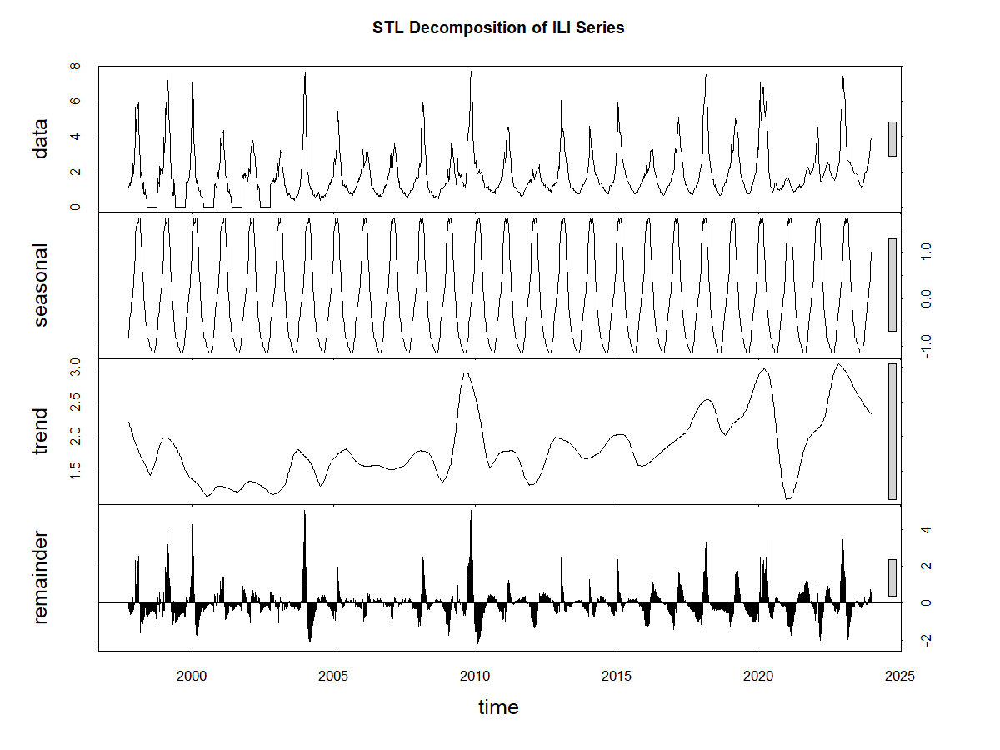
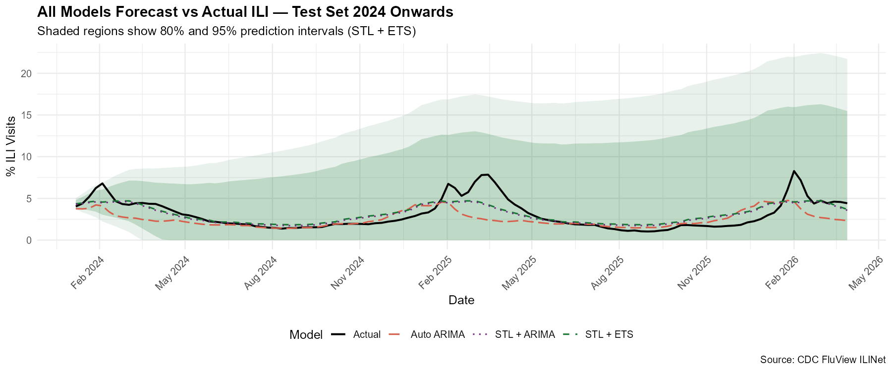
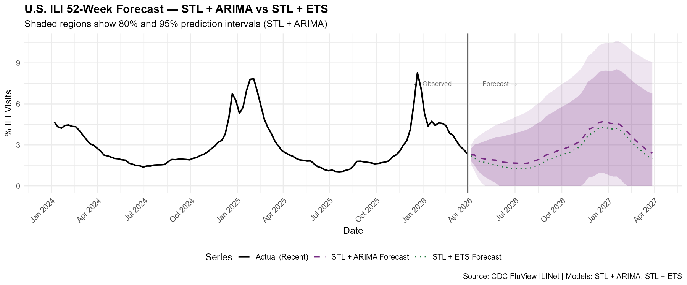
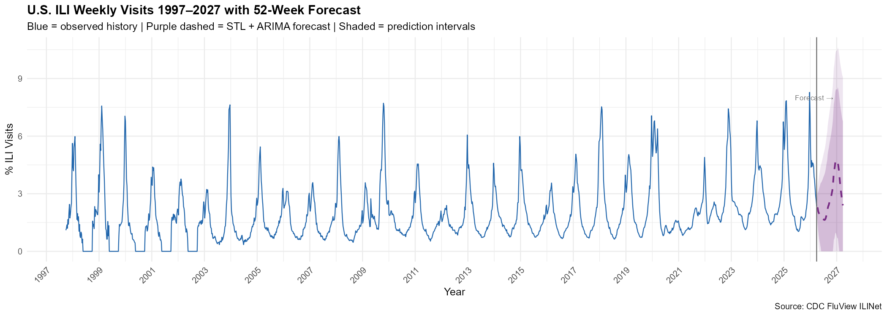

# Forecasting U.S. Influenza-Like Illness (ILI) Trends

## Overview
This project applies time series forecasting models to predict weekly 
U.S. Influenza-Like Illness (ILI) activity using CDC FluView surveillance 
data spanning 1997 to 2026. Three model families are compared: Seasonal 
ARIMA, STL + ETS, and STL + ARIMA.

## Background and Motivation
Influenza affects millions of Americans annually, straining healthcare 
systems and causing significant economic losses. Accurate forecasting of 
ILI activity allows public health officials to allocate resources, time 
vaccination campaigns, and issue early warnings. This project demonstrates 
how classical time series methods can produce reliable short-to-medium 
range forecasts using freely available CDC surveillance data.

## Research Questions
1. Can we accurately forecast weekly U.S. ILI activity?
2. Which model performs better — ARIMA or STL-based ETS/ARIMA?
3. What seasonal patterns exist in ILI data and how have they shifted over time?
4. How did COVID-19 disrupt the normal ILI pattern?

## Data
- **Source:** CDC FluView ILINet Surveillance System
- **Coverage:** September 1997 – March 2026 (1,488 weekly observations)
- **Target variable:** % weighted ILI (percentage of outpatient visits 
  due to influenza-like illness)
- **Download:** https://gis.cdc.gov/grasp/fluview/fluportaldashboard.html

## Methodology
| Step | Description |
|------|-------------|
| 1 | Data cleaning and date conversion (MMWR week system) |
| 2 | Exploratory data analysis — trend, seasonality, COVID disruption |
| 3 | Stationarity testing — ADF and KPSS tests |
| 4 | ACF/PACF analysis — SARIMA order identification |
| 5 | ARIMA modeling — Manual SARIMA(1,1,2)(1,1,1)[52] vs Auto ARIMA |
| 6 | STL + ETS and STL + ARIMA modeling |
| 7 | Final 52-week forecast (April 2026 – March 2027) |

## Key Findings
- **STL + ARIMA** was the best performing model across all metrics
- COVID-19 caused a structural break in 2020 with ILI dropping to near zero
- The 2024–2025 flu season was historically severe, three of the top 10 
  worst weeks on record occurred during this period
- The model forecasts a peak ILI of approximately **4.7%** around 
  December 2026

## Model Performance — Test Set 2024 Onwards
| Model | RMSE | MAE | MSE | MAPE | MSPE |
|-------|------|-----|-----|------|------|
| Auto ARIMA(3,0,2)(2,1,1)[52] | 1.544 | 1.059 | 2.385 | 28.86% | 12.75% |
| STL + Auto ETS | 1.041 | 0.755 | 1.084 | 27.70% | 12.54% |
| **STL + ARIMA** | **1.042** | **0.730** | **1.086** | **25.22%** | **10.34%** |

## Visualizations

### Full ILI History 1997–2026


### STL Decomposition


### All Models vs Actual — Test Set


### 52-Week Final Forecast


### Full History with Forecast


## Limitations
- Prediction intervals widen substantially beyond 8–12 weeks, 
  limiting practical use for long-horizon forecasting
- Models were trained on pre-2024 data and could not anticipate 
  the historically severe 2024–2025 flu season
- The COVID-19 structural break (2020–2021) introduces instability 
  in parameter estimates — future work could explore intervention 
  models or excluding the COVID period from training
- ILI % is a proxy measure, it reflects healthcare-seeking behavior 
  as much as true disease prevalence

## Repository Structure
```
flu-ili-forecasting/
├── data/
│   └── ILINet.csv              # Raw CDC ILINet surveillance data
├── scripts/
│   ├── 01_data_clean.R         # Data loading and cleaning
│   ├── 02_eda.R                # Exploratory data analysis
│   ├── 03_stationarity.R       # ADF and KPSS stationarity tests
│   ├── 04_acf_pacf.R           # ACF/PACF plots and SARIMA identification
│   ├── 05_arima.R              # ARIMA modeling and evaluation
│   ├── 06_ets.R                # STL + ETS modeling and evaluation
│   └── 07_final_forecast.R     # Final 52-week forecast
└── outputs/
    ├── 01_ili_full_timeseries.png
    ├── 02_differenced_series.png
    ├── 03_acf_plot.png
    ├── 04_pacf_plot.png
    ├── 05_arima_forecast_vs_actual.png
    ├── 06_stl_decomposition.png
    ├── 07_all_models_forecast.png
    ├── 08_final_forecast.png
    ├── 09_full_history_forecast.png
    └── forecast_52weeks.csv    # 52-week point forecasts and intervals
```

## How to Reproduce
1. Download `ILINet.csv` from the CDC FluView link above and place in `data/`
2. Open RStudio and install required packages:
```r
install.packages(c("readr", "dplyr", "ggplot2", "forecast", 
                   "tseries", "MMWRweek", "lubridate"))
```
3. Run scripts in order from `01_data_clean.R` to `07_final_forecast.R`
4. All outputs will be saved automatically to the `outputs/` folder

## Future Work
- Explore machine learning approaches such as LSTM neural networks 
  for comparison against classical time series methods
- Incorporate exogenous variables such as vaccination rates, 
  temperature, and humidity as predictors
- Build a regional model disaggregating national ILI into 
  HHS regions for more targeted public health forecasting
- Develop an intervention model to explicitly account for the 
  COVID-19 structural break

## Author
**Princess Tagoe**  
MS Applied Data Science — East Tennessee State University  
Spatio-temporal analysis | Public health data | Time series forecasting  
[Medium Blog](https://medium.com/@princesstagoe24)
